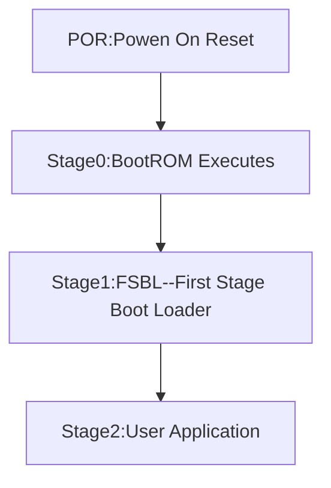
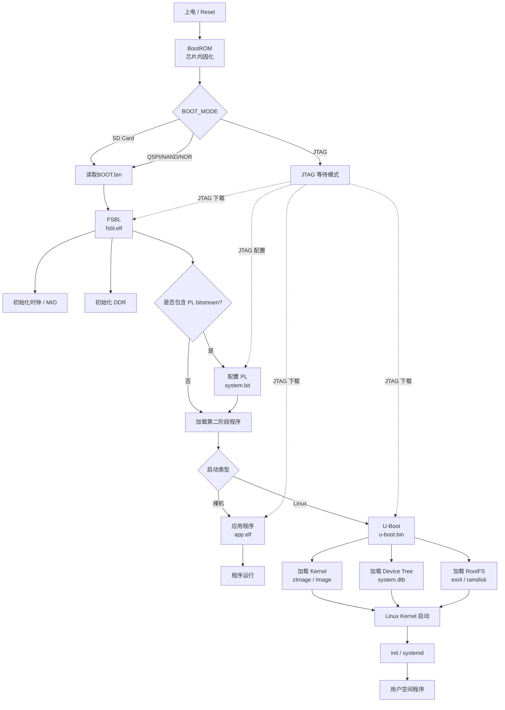
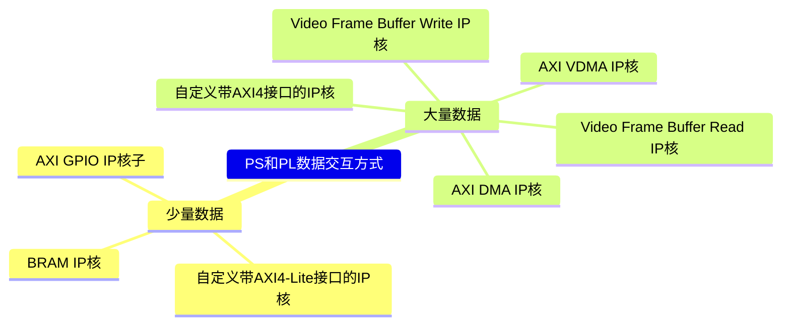

---
cssclasses:
  - 笔记
---
>[!important] Zynq 
> 1. 型号：xc7z010clg400-1 
> 2. DDR型号：MT41J128M16 HA-125
> 3. MIO电压：Bank500和Bank501由硬件决定不可修改，二者电压在BOOT阶段由MIO[8:7]声明用来配置 Bank的 IO 电压模型
> 4. Vits的app工程添加[[Zynq杂记|库函数]]前要先编译Platform
## GPIO
>[!note]
>Bank0/1的GPIO的MIO引脚是正常的双向IO口，支持三态，输出除能，处于高阻态
>Bank2/3的GPIO的EMIO引脚不支持三态，因此不受OEN寄存器控制
### MIO
>[!important]
>- 每个MIO都可成为GPIO
>- GPIO分为4组，Bank0/1对应MIO（**注意这里和Bank500/501没有关系，32b属于Bank0，22b属于Bank1**），Bank2/3对应EMIO，**这四组都由其对应的一组寄存器控制**
#### 寄存器配置
1. 确定配置的MIO引脚以及对应的GPIO引脚、GPIO基地址、GPIO所在Bank0/1的DIRM和OEN控制寄存器的偏移地址
2. 配置方向模式寄存器，写0x0000_0080到寄存器DIRM_0（**以MIO7举例**）
3. 配置输出使能寄存器，写0x0000_0080到寄存器OUTEN_0（**以MIO7举例**）
4. 写数据到GPIO引脚（**读修改**或者使用**MASK屏蔽读写函数**）
    - MASK值为1代表屏蔽该位，为0表示操作，这里为0xff7f
    - 数据值data=0x0080（写1），data=0x0000（写0）
    - 将数据写到MASK_DATA_0_LSW（**0xff7f_0080或者0xff7f_0000**)
#### 库函数配置
>[!danger]
>老版的Vits是**非SDT工程**，通过device_id来去查找器件的配置信息；新版的Vits是**SDT工程**，通过外设的BaseAddr来查找器件的配置信息，此宏定义在#include "xparameters.h"中
- 库函数本质只是对寄存器控制做了一层"薄“封装，而非像Stm32的HAL库一样高级抽象。另外许多约束需要外部调整（如管脚电压约束），而非像Stm32固化
## EMIO
- PS端的引脚不够，可以使用EMIO把功能引脚映射到PL端的引脚上
- EMIO的PL端实现三态功能使用了三个端口，需要**Make External**引出到一个接口（实际上是添加了PL端的IOBUF逻辑模块）实现双向IO
- **EMIO引脚绑定到哪个PL管脚上是由约束文件决定的**
- `GPIO_EMIO[0]`对应PIN_54,以此递增
- 输入是来自PL的连线，与输出值或OEN寄存器无关。若DIRM设置为0，可以从DATA_RO寄存器中读取输入值。
- 输出不支持三态，因此不受OEN寄存器的控制。输出时将DIRM设置为1，使用DATA、MASK_DATA_LSW、MASK_DATA_MSK寄存器配置输出值。
- EMIO GPIO 的输出数据始终有效，不受 OEN 控制；但 PS 是否使能该输出，是通过 DIRM 和 OEN 生成 EMIOGPIOTN 信号通知 PL 的。
***
### 中断实验
>[!note]
>GPIO所有管脚都可开启中断，但共用**中断ID 52U**与中断服务函数。所以多个引脚开启中断需要通过INT_STAT和INT_MASK联合判断来自哪个引脚
- INT_TYPE：设置中断检测类型，边沿or电平
- INT_POLARITY：极性控制
- INT_ANT：边沿触发有效，为"1"双沿检测，为“0”由INT_POLARITY控制
- INT_STAT：写"1"可以清除中断标志，读值判断中断状态
- INT_MASK：读值判断哪些GPIO位开启中断
- INT_DIS：除能中断
- INT_EN：使能中断
- 所有GPIO共用一个中断函数，注意多个GPIO开启中断的处理方式
- 使用中断回调函数，自定义中断服务函数可使用参数Bank，Status，中断标志位由系统函数清除；直接关联自定义中断服务函数则不行
- 异常注册使用Xil_ExceptionHandler，中断函数关联使用Xil_InterruptHandler
***
## AXI_GPIO
>[!note]
>- **AXI_GPIO是ZYNQ PL部分的一个IP核**，实现了通用输入输出接口的功能，并通过AXI协议实现了与PS端的通信，使得开发者可以放地控制和扩展GPIO口。
>- 两组M_AXI_GP：32位数据总线
>- 一组S_AXI_GP：32位数据总线
>- 四组S_AXI_HP：带有fifo缓冲，数据宽度32位或者64位
>- 一组S_AXI_ACP：加速器一致性接口，在PL和APU内的SCU之间的单个异步连接，总线宽度64位。此端口用来实现APU cache和PL单元之间的一致性

| 对比项      | GPIO            | AXI GPIO            |
| -------- | --------------- | ------------------- |
| 资源类型     | 硬核              | 软核（PL端资源实现）         |
| 连接IO     | 可连接至PS IO/PL IO | 不能连接PS IO，只能连接PL IO |
| 连接PL逻辑   | 支持（EMIO）        | 支持                  |
| 灵活性和可扩展性 | 较低              | 较高                  |
- GP接口适用于中低速场景，数据量少
- HP接口使用与高速传输，数据量大
- ACP加速器一致性接口，加速传输
- AXI-Full：高性能接口，适用高性能内存映射的需求，支持单次最高突发传输256个数据
- AXI-Lite：轻量级，用于存储器映射的单次数据通信，优点占用PL端逻辑少
- AXI-Stream：传输时不指定地址，适用于数据流传输，如视频流、图像处理等
- GPIOx_TRI写1是读端口值
- AXI Interconnect IP核用于将一个（或多个）AXI存储器映射的主器件连接到一个（或多个）存储器映射的主器件，互联实际上是一个开关，它管理并指挥所有连接的AXI接口之间的通信
- **这里的中断请求是从PL端传输过来的，故要设置PS端的IRQ接口，中断号61U**
- ZYNQ端是AXI3，需要AXI互联才可连接AXI4
- **在IP Block中要引出设置的AXI_GPIO引脚并绑定PL管脚**
### ILA与Debug
- IP Block中选中信号线右击debug添加ILA，烧录后使用Vivado连接器件可进行PL端调试，取消debug右击clear debug
- 综合后set up debug可以观察 IP 核内部的信号，类似于使用FPGA的网表debug，但是很多信号被优化，可以在 IP 核代码中添加mark-debug属性`(*mark_debug="true"*)`后再添加，取消debug删除xdc文件即可
***
## Zynq固化实验（Vits IDE）

- 主模式Master Mode：Nor Flash、Nand Flash、Qspi Flash、SD card
- 从模式Slave Mode：Jtag
- Zynq前三种只能选一，因为引脚冲突，后支持SD card和Jtag
- Zynq无法只固化PL端bit文件，这里可以把PL端看作是PS的一个外设
- **SD/QSPI/JTAG 启动：只影响上电自动启动**  
- **JTAG：始终可以用来下载、调试、甚至烧 Flash**  
- **为了避免冲突，JTAG烧录代码时使用JTAG启动方式**
- QSPI速率超过40MHz需要使用feedback
- 命令面板Bootgen（BOOT.bin复制到SD card）
- 命令面板Program Flash（BOOT.bin、fsbl.elf）
- **在fsbl_debug.h中添加`#FSBL_DEBUG_INFO`可以打印fsbl的调试信息**



***
## 自定义IP核--呼吸灯
>[!note]
>该实验与AXI_GPIO原理类似，PS通过AXI协议与PL端进行通信。**通过写入寄存器控制呼吸灯模块**。注意在封装IP核之后要修改Makefile文件
- 计数器位宽留有余量，否则计数器溢出达不到设定值，呼吸灯不会闪烁
- 另外在总结章节可以为ip核提供额外输入端口输入数据（常数ip核生成）进行测试
- **添加.v源文件在hdl文件夹下**
- 在非工程页面下打包和在工程中打包生成的文件并不一样
***
## UART串口中断
- 中断请求IRQ ID 59，82
- 只有EMIO引脚支持流控制modem control
- **通过APB总线控制UART硬件外设和读写数据到FIFO**
- 四种模式：正常模式、回音模式、本地回环、远端回环
- 设置：正常模式、停止位1位、无校验位、数据8位、rxfifo阈值1
- 添加串口打印函数打印失败是因为uart初始化影响，可以延时或等待初始化完毕后打印
- 打印函数指向的uart可通过修改`STDIN_BASEADDRESS`和`STDOUT_BASEADDRESS`地址来指定
- 功能函数指向的uart可以通过器件id和器件中断号来选择
***
## 定时器
- 每个处理器都有1个32私有位定时器和32位私有看门狗，共享一个全局64位定时器，1/2cpu频率
- 系统层面有2个TTC定时器和1个系统看门狗，其时钟可来自外部，系统看门狗可以复位PL端
- 定时器有单次模式和自动重装载模式；私有定时器默认使能，无需在IP中使能
- ZYNQ提供了私有定时器的库函数，而MPSoc则没有。
***
## I2C读写EEPROM
>[!note] EEPROM
>- AT24C64存储64kb（8k字节）
>- 字节写模式：一个地址一个数据进行写入
>- 页写模式：连续写入，只需一个起始地址，但是页限制，溢出会覆盖。但是读出会自动翻页
>- 写周期较慢，两次写入间隔10ms
```C
#define READ_CMD				1
#define WRITE_CMD				0

#define x24C32//器件名称，AT24C32、AT24C64、AT24C128、AT24C256、AT24C512
#define DEV_ADDR				0xA0					//设备硬件地址

#ifdef x24C32
 	#define PAGE_NUM			128						//页数
	#define PAGE_SIZE			32						//页面大小(字节)
	#define CAPACITY_SIZE		(PAGE_NUM * PAGE_SIZE)	//总容量(字节)
	#define ADDR_BYTE_NUM		2						//地址字节个数
#endif
 
#ifdef x24C64
 	#define PAGE_NUM			256						//页数
	#define PAGE_SIZE			32						//页面大小(字节)
	#define CAPACITY_SIZE		(PAGE_NUM * PAGE_SIZE)	//总容量(字节)
	#define ADDR_BYTE_NUM		2						//地址字节个数
#endif
 
#ifdef x24C128
 	#define PAGE_NUM			256						//页数
	#define PAGE_SIZE			64						//页面大小(字节)
	#define CAPACITY_SIZE		(PAGE_NUM * PAGE_SIZE)	//总容量(字节)
	#define ADDR_BYTE_NUM		2						//地址字节个数
#endif
 
#ifdef x24C256
 	#define PAGE_NUM			512						//页数
	#define PAGE_SIZE			64						//页面大小(字节)
	#define CAPACITY_SIZE		(PAGE_NUM * PAGE_SIZE)	//总容量(字节)
	#define ADDR_BYTE_NUM		2						//地址字节个数
#endif
 
#ifdef x24C512
 	#define PAGE_NUM			512						//页数
	#define PAGE_SIZE			128						//页面大小(字节) 
	#define CAPACITY_SIZE		(PAGE_NUM * PAGE_SIZE)	//总容量(字节)
	#define ADDR_BYTE_NUM		2						//地址字节个数
#endif
```
 - **通过APB总线控制I2C硬件外设
 - 主模式下的从机监控可以用来debug
 - **批处理脚本创建Vivado工程**
***
## SD卡与FATFS文件系统
- 文件系统：存储设备上组织文件的方法
- 小型嵌入式系统常使用FAT32和exFAT文件系统
- 扇区：最小物理读写单元
- 簇：文件系统管理磁盘空间的最小单元，文件占用空间按簇的整数倍进行分配，其本质是多个扇区的集合
- zynq最大支持32gb，协议规范SD2.0
- SD/SDIO控制器支持SDIO设备、SD卡和eMMC卡，eMMC卡不支持第一启动设备
- 处理器通过AHB访问 SD/SDIO控制器
- **在板级支持包中添加xilffs库并可通过GUI配置（文件名大小写、使能f_puts()等函数...）**
- 逻辑驱动器号：用来指定要挂载的是哪一个“盘符”或“设备，字符串："0:"、"1:"
- **若挂载多个设备，可在文件名加上对应的逻辑驱动号**
 ***
## AXI BRAM控制器
- 处理器不直接驱动BRAM端口，而是通过软IP核AXI Bram Control控制器驱动Bram
 - 控制器可选择AXI4-Lite协议或者AXI4协议
 - BRAM的深度无法在控制器或者BRAM的IP核中指定，必须在Address Editor中修改
 - 自定义IP核的引脚整体封装成Bus Interface，封装后的引脚参数要与对应IP核的参数保持一致
 - Ultra RAM是超高速RAM，适用于需要大容量片上缓冲的场景（如视频#处理、高速数据流和机器学习等），尤其在MPSoc中与Block RAM互补使用（注：ZYNQ芯片中没有URAM，仅MPSoc的部分芯片中有）

***
## AXI协议
- AXI（Advanced Extensible Interface 高级可扩展总线）是AMBA（高级微控制器总线架构）协议规范的一部分
- AMBA包括APB（Advanced Peripheral Bus 高级外设总线）、AHB（Advanced High-performance Bus 高级高性能总线）、AXI
- AXI-Full：高性能接口，适用高性能内存映射的需求，支持单次最高突发传输256个数据
- AXI-Lite：轻量级，用于存储器映射的单次数据通信，优点占用PL端逻辑少
- AXI-Stream：传输时不指定地址，单次突发传输的数据个数没有限制，适用于数据流传输，如视频流、图像处理等
- <mark style="background: #FF5582A6;" >突发传输：单个传输事务中连续传输多个数据，传输时仅需发送起始地址，后续地址由硬件自动推断或递增</mark>
- <mark style="background: #FF5582A6;">AXI与AXI4-Lite都有五个通道，每个通道负责不同的数据传输功能，通过分离地址、数据和控制信号实现高效并发操作；AXI4-Stream只有一个数据通道</mark>
- 通道
> [!important]
> - 写地址通道aw：主设备向从设备发送写操作的起始地址和控制信息，如突发传输类型、长度和数据宽度等
> - 写数据通道wd：主设备向从设备发送待写入的数据，支持突发传输和字节使能控制
> - 写响应通道br：从设备向主设备返回写操作的状态（成功或错误）
> - 读地址通道ar：主设备向从设备发送读操作的起始地址和控制信息，如突发传输类型、长度和数据宽度等
> - 读数据通道rd：从设备向主设备返回主设备请求的数据，并附带传输状态
- 通道定义
 > [!important]
> - 每个独立通道都包含一组信息信号，以及用于提供双向握手机制的VALID和READY信号组成（主从设备都可以控制数据传输速率）
> - 信息源端使用VALID信号表示当前通道地址、数据和控制信息什么时候有效
> - 目的端使用READY信号表示什么时候可以接收信息
> - 读数据通道和写数据通道都包含一个LAST信号，用于表示传输的最后一个数据
- 通道间的协作与特点
> [!important]
> - 握手机制：所有通道都采用VALID和READY握手，确保数据传输的可靠性
> - 突发传输：仅AXI4支持突发传输（最大256数据），AXI4-Lite仅支持单次传输
> - 独立性：五个通道可以并行操作，例如读写地址通道可同时工作，实现全双工通信
> - 时序依赖：写响应必须等待写地址和写数据通道完成，读数据必须等待读地址通道完成
- 握手机制
> [!important]
> - AXI协议采用VALID和READY双向握手机制来实现数据流控
> - 握手成功的条件：只有当VALID和READY信号同时为高电平时，才表示一次成功的握手，此时在时钟上升沿传输数据
> - 独立性原则：VALID和READY信号必须完成独立，不能相互依赖，以避免死锁
> - VALID先于READY有效（源端即发送方不能等待READY信号有效后才拉高VALID信号；一旦VALID信号被拉高，必须保持到握手完成）
> - READY先于VALID有效（目的端即接收方允许在VALID信号有效后，再拉高对应的READY信号；READY信号拉高后，允许VALID信号拉高前拉低READY信号）
> - READY与VALID同时有效
- AXI互联通信
> [!important]
> - AXI Interconnect IP核和AXI SmartConnect IP核是Xilinx提供的两种用于管理AXI总线互联的关键IP，均支持多主多从设备的连接，但在设计目标、性能优化、使用场景等方面存在显著差异
> - 前者适用于对性能要求不高，资源有限的通信场景、后者是升级版适用于高性能、低延时的通信场景

***
## PL读写PS端的DDR
- 创建自定义AXI4的IP核，使用HP高性能接口，读写内存大小4k字节
- ZYNQ系列HP接口PL做为主接口，与GP区别在于多了两个FIFO，因此AXI HP也可称为AFI（AXI FIFO Interface），HP接口数据位宽可到32或者64位，GP接口只能是32位