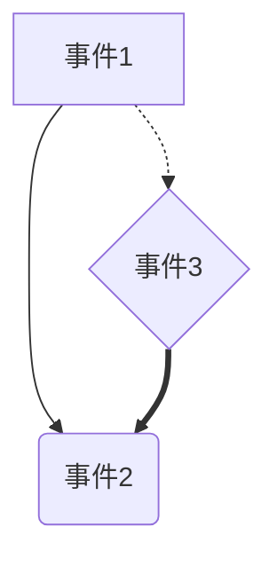
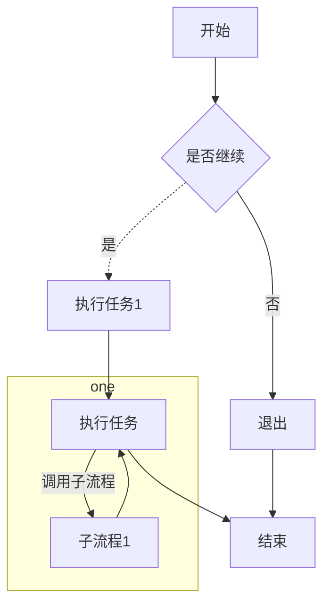
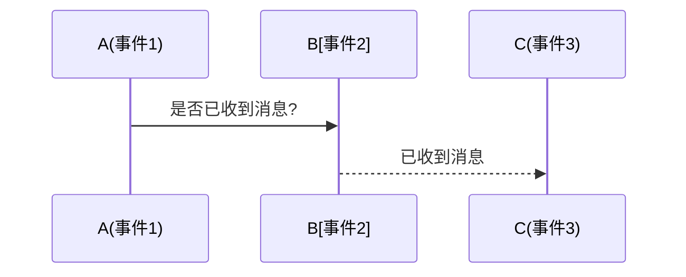
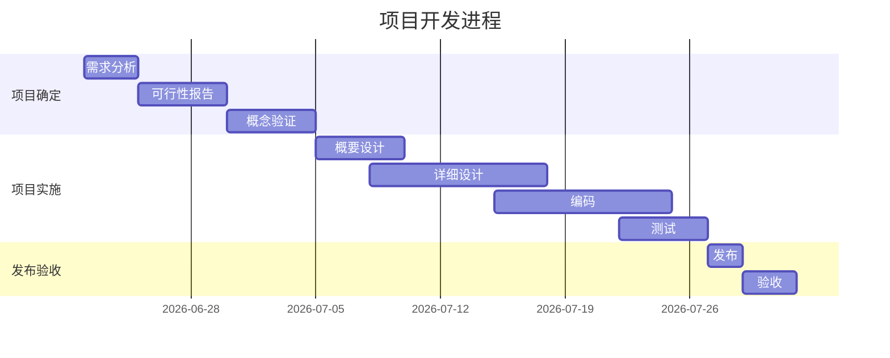
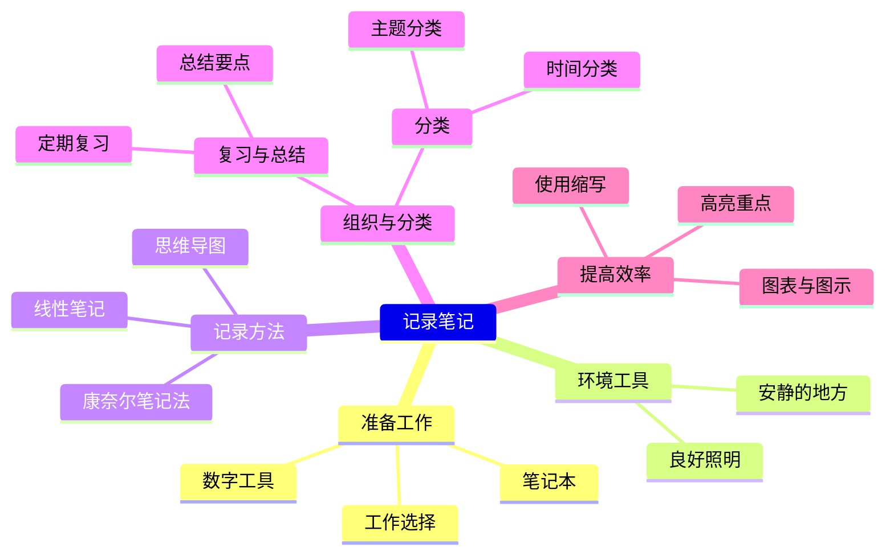
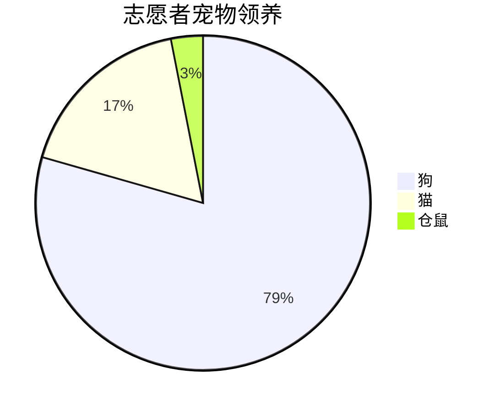

---
cssclasses:
  - 笔记
---
# Markdown基本语法  

## 标题  

```markdown
# 一级标题
## 二级标题
### 三级标题
```

## 段落

Hello World！  

## 换行

```markdown
使用换行符<br>

句子末尾双空格加回车
```

## 粗体

```markdown
双星号

双下划线（不推荐）
```

你好，我是**李宇涵**  

## 斜体

```markdown
单星号

单下划线（不推荐）
```

你好，我是*李宇涵*

## 删除线

```markdown
~~你好~~
```

~~你好~~

## 下划线

```markdown
<u>你好</u>

```

<u>你好</u>

## 文本高亮

```markdown
==你好==
```

==你好==

## 字体、字号、颜色

```markdown
<font face="宋体" color="red" size=5>我是一个文本</font>
```

<font face="宋体" color="red" size=5>我是一个文本</font>

## 外部链接

```markdown
[李宇涵的github](https://github.com/liyuhan355/liyuhan)
```

[李宇涵的github](https://github.com/liyuhan355/liyuhan "最好的程序员")  

## URL和电子邮件  

```markdown
<https://github.com/liyuhan355/liyuhan>  

<15531265180@163.com>
```

<https://github.com/liyuhan355/liyuhan>  
<15531265180@163.com>  

## 格式化链接  

```markdown
<github>或setup()这种文本标签或函数会被解析不显示在正式文件中，必须使用行内代码块符号``可以处理这种标签

居中解释标签<center></center>
```

[`<github>`](https://github.com/liyuhan355/liyuhan)

## 插入图像

```markdown


图像链接:[](https://pic3.zhimg.com "美女图片")

本地地址:
```


[](https://www.bizhi99.com/ "美女图片")  
<center>美女图片</center>  

## 引用块  

```markdown
>引用块
>>嵌套引用
>>>嵌套引用

带段落的引用块
>引用块
>引用块
>引用块

带其他元素的引用块
> - 引用块
> - 引用块
> - 引用块
```

>引用块
>>嵌套引用
>>>嵌套引用  

带段落的引用块  
>引用块  
>引用块  
>引用块

带其他元素的引用块
> - **引用块**
> - ~~引用块~~
> - *引用块*

## 无序列表

```markdown
- 列表1
    - 嵌套列表1
        - 嵌套列表2
- 列表2
- 列表3

无序列表嵌套最好用2个空格
```

- 列表1<br>
    - 嵌套列表1<br>
    - 嵌套列表2<br>
- 列表2<br>
- 列表3<br>
## 有序列表

```markdown
1. 列表1
2. 列表2
3. 列表3
    1. 嵌套列表1
    2. 嵌套列表2

有序列表嵌套最好用tab/4个空格
```

1. 列表1
2. 列表2
3. 列表3  
    1. 嵌套列表1
    2. 嵌套列表2

## 分割线

```markdown
---

***
___

```

---

***
___

## 代码块

```markdown
`我是一个行内代码块`

如果块代码块中是代码，则将上面的markdown换成对应语言，会显示代码高亮
如果块代码块嵌套，则应增加最外层`的数量
```

`我是一个行内代码块`

# Markdown进阶语法

## 转义字符

```markdown
显示特殊字符用\
```

反引号:\`  

星号:\*  

下划线:\_  

大括号:\{\}  

方括号:\[\]  

圆括号:\(\)  

井号:\#  

加号减号:\+\-  

点号:\.  

感叹号:\!  

管道符:\|

## 表格

```markdown
几列数据用几个---
左对齐(默认):--- 右对齐:---: 居中对齐:---:
```

 | 表头列1 | 表头列2 | 表头列3 | 表头列4 |  
 | :---: | :---: | :---: | :---: |
 | 数据1 | 数据2 | 数据3 | 数据4 |
 | 数据5 | 数据6 | 数据7 | 数据8 |  

 | 表头列1 | 表头列2 | 表头列3 | 表头列4 |  
 | ---: | :--- | ---: | :--- |
 | 数据1 | 数据2 | 数据3 | 数据4 |
 | 数据5 | 数据6 | 数据7 | 数据8 |  

## 脚注  

```markdown  
在需要添加脚注的文本后,使用[^标识符]

为特定术语提供解释

引用外部资源(网页,博客)

加添附加信息(作者信息,版权声明)
```

李宇涵[^1]  
[^1]: 人名

## 上标  

```markdown
2^10^
```

x^2^
2^10^  

## 下标

```markdown
x~2~  
```

x~2~

## ToDo 列表(待办事项)

```markdown
基于无序列表
- [ ] 未完成

- [x]  已完成

事项嵌套最好用两个空格
```

- [ ] 事项1
  - [ ] 事项1.2
- [x] 事项2
  - [x] 事项2.1

## 锚点  

```markdown
定义锚点
<a id="my">锚点内容可以不写</a>

引用锚点
[锚点内容必须填写](#my)

引用锚点可以帮助快速跳转到页面定义锚点的位置  
```

定义锚点
<a id="my">锚点内容可以不写</a>

引用锚点
[锚点内容必须填写](#my)

### 目录

- [1、引言](#a)  

- [2、正文](#b)  

- [3、结束](#c)  

### 1、引言<a id="a"></a>

这是引言这是引言这是引言这是引言这是引言这是引言这是引言这是引言这是引言这是引言这是引言这是引言这是引言这是引言这是引言这是引言这是引言这是引言这是引言这是引言这是引言这是引言这是引言这是引言这是引言这是引言这是引言这是引言这是引言这是引言这是引言这是引言这是引言这是引言这是引言这是引言这是引言这是引言这是引言这是引言

### 2、正文<a id="b"></a>  

这是正文这是正文这是正文这是正文这是正文这是正文这是正文这是正文这是正文这是正文这是正文这是正文这是正文这是正文这是正文这是正文这是正文这是正文这是正文这是正文这是正文这是正文这是正文这是正文这是正文这是正文这是正文这是正文这是正文这是正文这是正文这是正文这是正文这是正文这是正文这是正文这是正文这是正文这是正文这是正文

### 3、结束<a id="c"></a>

这是结束这是结束这是结束这是结束这是结束这是结束这是结束这是结束这是结束这是结束这是结束这是结束这是结束这是结束这是结束这是结束这是结束这是结束这是结束这是结束这是结束这是结束这是结束这是结束这是结束这是结束这是结束这是结束这是结束这是结束这是结束这是结束这是结束这是结束这是结束这是结束这是结束这是结束这是结束这是结束

# Markdown高阶语法

## latex公式

```markdown

latex：排版工具

overleaf：在线编辑latex公式
```

## 行内公式

```markdown

使用$...$ 包围公式(书写公式使用latex语法而非markdown)
```

$E=mc^2$  
2^10^
$2^{10}$  

## 行间公式  

```markdown
$$E=mc^2$$
```

$$
E=mc^2
$$

$$
\sum_{i=1}^{n}i=\frac{n(n+1)}{2}
$$

## 常用符号与命令  

- 上标与下标：`^`表示上标，`_`表示下标。例如`$x_i^2$`渲染为$x_i^2$  

- 分数：`\frac{分子}{分母}`。例如`$\frac{2}{3}$`渲染为$\frac{2}{3}$

- 根号：`\sqrt(表达式)`。例如`$\sqrt(\frac{2}{3})$`渲染为$\sqrt(\frac{2}{3})$

- 求和与积分：`\sum`和`\int`表示求和与积分。例如`$\sum_{i=1}^{n}$`和`$\int_{a}^{b}f(x)\,dx$`分别渲染为$\sum_{i=1}^{n}$和$\int_{a}^{b}x^2 \,dx=1$

- 矩阵：使用`\begin{matrix}...\end{matrix}`或`\begin{bmatrix}...\end{bmatrix}`等环境来创建矩阵。

- 希腊字母：`\alpha`,`\beta`,`\gamma`,`\delta`,`\psi`,`\infty`,`\sin`,`\pi`渲染为 $\alpha$,$\beta$,$\gamma$,$\delta$,$\psi$,$\infty$,$-\infty$,$\pi$,$\sin$

## 基础数学表达式

### 分数

- 公式：`\frac{分子}{分母}`
- 渲染：$\frac{2}{3}$

### 根号  

- 公式：`\sqrt{x}`或`\sqrt[n]{x}`(多次根号)
- 渲染：$sqrt[3]{\frac{2}{3}}$

### 上标和下标

- 公式：`x^2`,`x_2`  
- 渲染：$x^2$，$x_2$  

### 求和与积分

- 公式；`\sum_{i=1}^{n}`,`\int_{-\infty}^{\infty}x^2\,dx`  
- 渲染：$\sum_{i=1}^{n}$,$\int_{-\infty}^{\infty}x^2\,dx$

## 复杂数学公式

### 极限

- 公式：`\lim_{x\to\infty}f(x)`
- 渲染：$\lim_{x\to\infty}f(x)$

### 偏导数

- 公式：`\frac{\partial f}{\partial x}`
- 渲染：$\frac{\partial f}{\partial x}$

### 积分中的复杂表达式

- 公式：`\int_{0}^{\frac{\pi}{2}}\sin^2(x)\,dx=\frac{\pi}{4}`
- 渲染：$\int_{0}^{\frac{\pi}{2}}\sin^2(x)\,dx=\frac{\pi}{4}$

### 多重求和积分

- 公式：`\sum_{i-1}^{n}\sum_{j-1}^{m}\int_{a}^{b}f(i,j,x)\,dx`
- 渲染：$\sum_{i-1}^{n}\sum_{j-1}^{m}\int_{a}^{b}f(i,j,x)\,dx$

## 特定数学领域公式

### 概率论中的期望

- 公式：`E[x]=\sum_{x} x \cdot P(X=x)`
- 渲染：$E[x]=\sum_{x} x \cdot P(X=x)$

### 线性代数中的向量点积

- 公式：`\vec{a} \cdot \vec{b} = |\vec{a}| |\vec{b}| \cos \theta`
- 渲染：$\vec{a} \cdot \vec{b} = |\vec{a}| |\vec{b}| \cos \theta$

### 微积分中的链式法则

- 公式：`\frac{dy}{dx} = \frac{dy}{dt} \cdot \frac{dt}{dx}`
- 渲染：$\frac{dy}{dx} = \frac{dy}{dt} \cdot \frac{dt}{dx}$

## 常用latex公式符号

### 基本数学符号

|符号|latex命令|示例|渲染效果|
|----|----|----|----|
|加号|`+`|`a+b`|$a+b$|
|减号|`-`|`a-b`|$a-b$|
|乘号|`\times`或`\cdot`|`a \times b`或`a \cdot b`|$a \times b$或$a \cdot b$|
|除号|`\div`或`/`|`a \div b`或`a/b`|$a \div b$或a/b|
|等于|`=`|`a=b`|$a=b$|
|不等于|`\neq`|`a \neq b`|$a \neq b$|
|大于小于|`><`|`a><b`|$a><b$|
|大于等于|`\geq`或`\geqslant`|`a \geq b`,`a \geqslant b`|$a \geq b$,$a \geqslant b$|
|大于等于|`\leq`或`\leqslant`|`a \leq b`,`a \leqslant b`|$a \leq b$,$a \leqslant b$|
|约等于|`\approx`|`a \approx b`|$a \approx b$|
|正负|`\pm`|`a \pm b`|$a \pm b$|
|无穷大|`\infty`|`\infty`|$\infty$|

### 集合符号

|符号|latex命令|示例|渲染效果|
|----|----|----|----|
|属于|`\in`|`a \in b`|$a \in b$|
|不属于|`\notin`|`a \notin b`|$a \notin b$|
|真包含于|`\subset`|`a \subset b`|$a \subset b$|
|包含于|`\subseteq`|`a \subseteq b`|$a \subseteq b$|
|并集|`\cup`|`a \cup b`|$a \cup b$|
|交集|`\cap`|`a \cap b`|$a \cap b$|
|空集|`\emptyset`或`\varnothing`|`\emptset`,`\varnothing`|$\emptyset$,$varnothing$|

### 函数和运算符

|符号|latex命令|示例|渲染效果|
|----|----|----|----|
|求和|`\sum`|`\sum_{i=1}^{n}`|$\sum_{i=1}^{n}$|
|积分|`\int`|`\int_{a}^{b}f(x)\,dx`|$\int_{a}^{b}f(x)\,dx$|
|极限|`\lim`|`\lim_{x \to \infty}f(x)`|$\lim_{x \to \infty}f(x)$|
|导数|`f'(x)`或者`\frac{dy}{dx}`|`f'(x)`或者`\frac{dy}{dx}`|$f'(x),\frac{dy}{dx}$|
|偏导数|`\partial`|`\frac {\partial f}{\partial x}`|$\frac {\partial f}{\partial x}$|

### 矩阵与行列式

|符号|latex命令|示例|渲染效果|
|----|----|----|----|
|矩阵|`\begin{matrix}...\end{matrix}`|`\begin{matrix} a & b \\ c & d \end{matrix}`|$\begin{matrix} a & b \\ c & d \end{matrix}$|
|积分|`\det`|`\det(A)`|$\det(a)$|

### 其他符号

|符号|latex命令|示例|渲染效果|
|----|----|----|----|
|角度|`\angle`|`\angle abc`|$\angle abc$|
|垂直|`\perp`|`ab \perp cd`|$ab \perp cd$|
|平行|`\parallel`|`ab \parallel cd`|$ab \parallel cd$|
|点积|`\cdot`|`a \cdot b`|$a \cdot b$|
|叉积|`\times`|`a \times b`|$a \times b$|
|模|`\mid`|`\mid \vec{a} \mid`|$\mid \vec{a} \mid$|
|范数|`\|`|`\|a\|`|$\|a\|$|
|逻辑与|`\land`|`p \land q`|$p \land q$|
|逻辑或|`\lor`|`p \lor q`|$p \lor q$|
|逻辑非|`\neg`或`\lnot`|`\neg p`或`\lnot p`|$\neg p$或者$\lnot p$|
|存在|`\exists`|`\exists x`|$\exists x$|
|任意|`\forall`|`\forall x`|$\forall x$|
|右箭头|`\rightarrow`或`\to`|`a \rightarrow b`或`a \to b`|$a \rightarrow b$,$a \to b$|
|左箭头|`\lefttarrow`或`\gets`|`a \leftarrow b`或`a \gets b`|$a \leftarrow b$,$a \gets b$|
|右箭头|`\leftrightarrow`|`a \leftrightarrow b`|$a \leftrightarrow b$|
|右箭头|`\mapsto`|`a \mapsto b`|$a \mapsto b$|

### 希腊字母

| 小写字母 | latex命令    | 大写字母 | latex命令    |
| ---- | ---------- | ---- | ---------- |
| α    | `\alpha`   | A    | `\Alpha`   |
| β    | `\beta`    | B    | `\Beta`    |
| γ    | `\gamma`   | Γ    | `\Gamma`   |
| δ    | `\deta`    | Δ    | `\Delta`   |
| ε    | `\epsilon` | E    | `\Epsilon` |
| ζ    | `\zeta`    | Z    | `\Zeta`    |
| η    | `\eta`     | H    | `\Eta`     |
| θ    | `\theta`   | Θ    | `\Theta`   |
| λ    | `\lambda`  | Λ    | `\Lambda`  |
| μ    | `\mu`      | M    | `\Mu`      |
| ξ    | `\xi`      | Ξ    | `\Xi`      |
| ο    | `\omicron` | O    | `\Omicron` |
| π    | `\pi`      | Π    | `\Pi`      |
| ρ    | `\rho`     | P    | `\Rho`     |
| σ    | `\sigma`   | Σ    | `\Sigma`   |
| τ    | `\tau`     | T    | `\Tau`     |
| φ    | `\phi`     | Φ    | `\Phi`     |
| ψ    | `\psi`     | Ψ    | `\Psi`     |
| ω    | `\omega`   | Ω    | `\Omega`   |

## 表情符号  

```markdown
直接复制

输入emoji短代码

Typora中自带表情包,可以使用:a就会自动弹出(b,c...)

也可在github复刻：https://github.com/zhouie/markdown-emoji
```

<https://github.com/zhouie/markdown-emoji>

:bowtie:  
😗  

## 绘制图形  

Markdown本身不支持绘制流程图的功能。然而，许多的Markdown的编辑器或扩展提供了对流程图的支持，通常是通过集成像Mermaid、Graphviz或PlantUML这样的图标和图形库来实现的

- 选择一个支持Mermaid语法的Markdown的编辑器。常见的选择有Typora、Vscode(配合预览扩展)等
- 启用Mermaid支持，在Typora中，要通过 设置->Markdown->扩展语法->勾选图表来启用Mermaid支持

### Mermaid流程图的基本语法

声明流程图代码块：在Markdown文件中，使用块代码块，并指定语言Mermaid

````markdown
```mermaid
[你的Mermaid代码]
```
````

指定流程图方向：Mermaid支持多种方向，包括从上到下(TB\TD)、从下到上(BT)、从左到右(LR)和从右到左(RL)。你可以在代码块开头使用graph或flowchart等关键字，并紧接着指定方向

```markdown
graph TD
graph BT
```

定义节点的连线

- 使用`[]`定义矩形节点
- 使用`()`定义圆形节点
- 使用`{}`定义菱形节点
- 使用`-->`,`---`,`-.-`,`-.->`,`==>`分别定义实线箭头,无箭头实线，无箭头虚线，带箭头虚线，加粗箭头
- 可以在连接线上添加文字描述，使用`|`将描述文字括起来



### 绘制流程图的步骤以及应用案例

- 定义起始节点：定义起始节点作为流程图的起点
- 添加后续节点和连接线：根据流程的逻辑，依次添加后续节点，并使用连接线将它们连接起来
- 添加子流程和条件判断：如果需要，可以使用`subgraph`关键字来定义子流程
- 自定义样式：可以使用Mermaid样式语法来自定义节点和连接线的颜色、边框等属性



### 序列图



### 甘特图

甘特图内在思想简单。基本是一条线条图，横轴表示时间，纵轴表示活动项目，线条表示在整个期间上计划和实际的活动完成情况。
它直观地表示任务计划在什么时候进行，以及实际进展与计划要求的对比。

d表示持续天数
after表示两个事件的依赖关系



### 思维导图



### 饼图



## 徽章

- [Shields.io](https://shields.io/):一个流行的在线徽章生成服务，支持自定义标签、消息、颜色、样式等
- [Badgen](https://badgen.net/):另一个在线徽章生成服务，提供了更多的动态数据源支持，如npm版本、Github状态等
- [Simple Icons Badges](https://simpleicons.org/):基于Simple Icons图标库的徽章生成服务，允许你使用各种流行的图标来创建徽章

### 使用Shields.io网站生成徽章

此徽章可以嵌入到Github Readme文件、博客文章或其他网页中  


### 生成徽章链接路径参数，拼接语法

标签、信息和颜色由破折号`-`分隔

> 拼接的链接地址： https://img.shields.io/badge/any_text-you_like-blue

|URL输入|标记输出|
|---|---|
|下划线`_`或`%20`|空格` `|
|双下划线`__`|下划线`_`|
|双破折号`--`|破折号`-`|

### Shields.io徽章配置路径参数

|参数|说明|示例值|
|---|---|---|
|Label|徽章标签，显示在徽章左侧|`Version`|
|Message|徽章消息，显示在徽章右侧|`1.0.0`|
|Color|徽章颜色，可以是预定义的颜色名或十六进展颜色代码|`blue`,`#ff6347`|
|Style|徽章样式,如flat、flat-squre、plastic、social等|`flat-squre`|
|Logo|徽章图标，可以是URL链接到图片|`https://example.com/logo.png`|
|LogoWidth|图标宽度，与Logo参数一起使用，调整图标大小|`20`|
|LogoColor|图标颜色，可以是预定义的颜色名或十六进展颜色代码|`white`|
|Link|徽章的链接,点击跳转到徽章地址|`https://example.com`|

### 在文本框中输入生成徽章对应的参数


> 注：生成徽章对应的参数语法和对应的值，参照以上配置表

生成后的Markdown的语法
``<br>
渲染效果:

### 使用Simple Icons Badges生成徽章图标

复制该网站上的图标别名，之后在Logo参数处粘贴


渲染效果：

### Badgen生成徽章


输入对应的参数，即可生成徽章

### Badgen生成后的Markdown的徽章语法


### Badgen生成带图标的徽章

具体的图标还是使用Simple Icons Badges图标库来进行生成,原链接添加?icon=图标别名


### Version Badge生成动态版本徽章


与vue官方使用的npm版本一致
[](https://badge.fury.io/js/vue)

### 超链接

[](https://shields.io/badges)

## obsidian扩展语法

### 笔记属性

```markdown
三个横线符可以为当前笔记添加属性 ---
```

### 本地(WiKi)链接

```markdown
必须注意附件必须在仓库的根目录下才可以使用
出链 [[]] 使用#可以链接到标题，^可以链接到文本，|可以指定显示文本
![[]]可以嵌入笔记，也可以配合上述扩展命令使用
```

### 引用与callout(标注)

```markdown
>
>[!note]
>>[!info]
折叠引用
>[!note] text
```

### 复制插入图片

```markdown
![[]]，图片会直接被拷贝进当下目录，再用本地链接
```
### 标签

```markdown
#你好
```
### Tab
```markdown
标准markdown语法就是使用tab表示代码块的，要表示层级关系需要写成无序列表，然后用tab、shift+tab控制缩进：
```